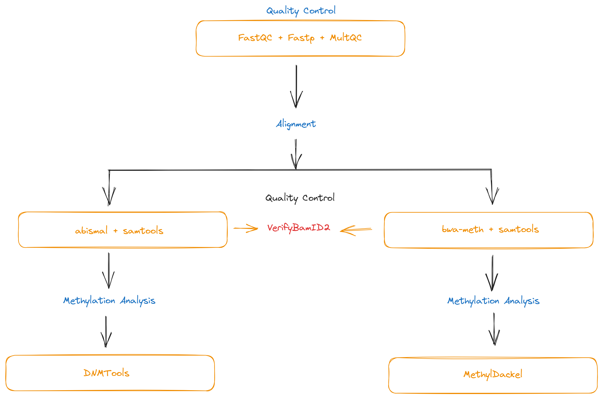

# Snakemake workflow: `snakemake-methylseq`

A Snakemake workflow that enables data processing of methylation sequencing platforms e.g
    bisulfite sequencing and enzymatic-methyl sequencing.

## Workflow

### Quality Control
1. FastQC
2. Fastp
3. MultiQC

### Alignment
1. Two aligners are used here;
    - [bwa-meth](https://github.com/brentp/bwa-meth) + samtools
    - [abismal](https://github.com/smithlabcode/abismal) + samtools
2. [VerifyBamID2](https://github.com/Griffan/VerifyBamID)

### Methylation Analysis
Two methods are employed;
1. [MethylDackel](https://github.com/dpryan79/MethylDackel)
    - Integrates well with bwa-meth
2. [DMNTools](https://dnmtools.readthedocs.io/en/latest/)
    - Integrates well with abismal

## Expected Output

### Quality Control
    <path-to-output-folder>\
    |   <project-name>\qc\
    |       fastqc\
    |           <sample>_<read>_fastqc.html
    |           <sample>_<read>_fastqc.zip
    |       fastp\
    |           <sample>_<read>.trimmed_fastqc.html
    |           <sample>_<read>.trimmed_fastqc.html
    |           <sample>_1.trimmed.fastq
    |           <sample>_2.trimmed.fastq
    |           <sample>_u1.fastq
    |           <sample>_u2.fastq
    |           <sample>.merged.fastq
    |           <sample>.failed.fastq
    |           <sample>.html
    |           <sample>.json
    |       multiqc\
    |           trimmed\
    |                multiqc_data\
    |                multiqc_report.html
    |           untrimmed\
    |                multiqc_data\
    |                multiqc_report.html

### Alignment
    1. bwa-meth + samtools + VerifyBamID2
    <path-to-output-folder>\
    |   <project-name>\alignment\bwa\
    |       unsorted/<sample>.sam
    |       sorted/
    |            <sample>.bam
    |            <sample>.bai
    |            <sample>.ancestry
    |            <sample>.selfsm
    |           /picard
    |                <sample>.bam
    |                <sample>.bam.bai
    |                <sample>.metrics.txt

    2. abismal + samtools + VerifyBamID2
    <path-to-output-folder>\
    |   <project-name>\alignment\abismal
    |       <sample>.bam
    |       <sample>.sorted.bam
    |       <sample>.sorted.bai
    |       <sample>.filtered.bam
    |       stats\
    |           <sample>.metrics.yaml
    |           <sample>.filtered.metrics.yaml
    |       verify_bam_id\
    |           <sample>.ancestry
    |           <sample>.selfsm

### Methylation Analysis
    1. DNMTools
    <path-to-output-folder>\
    |   <project-name>\methyl\dnmtools\
    |       <sample>.bsrate
    |       <sample>_single_base.meth
    |       <sample>_symmetric.meth
    |       <sample>_global.meth
    |       <sample>.hmr
    |       <sample>.hypermr
    |       <sample>.epiread
    |       <sample>.entropy.meth
    |       <sample>.avg.meth

    2. MethylDackel - To be completed

### Reference files
- Genome (hg38)
- Canonical cis-Regulatory elements

# TODO

- Add script to download and index reference files
- Add script to download `svd_mu` for VerifyBamID2
- Fix MethylDackel environment for to complete analysis
- Work on the format conversion between abismal and bwa-meth
- Fix errors from rules `entropy` and `avg_meth_level_region`
- Provide PC plots for contamination of samples